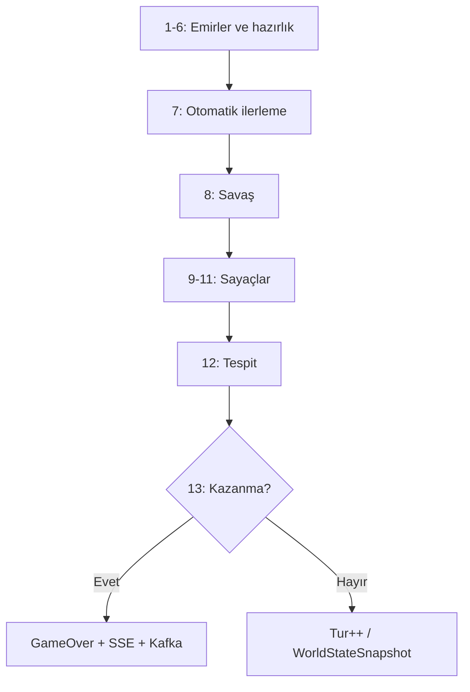

# Ring of the Middle Earth — Proje Raporu, Mimari Belge ve Sunum Kılavuzu

> **Ders:** Dağıtık Uygulama Geliştirme (Term Project) · Not ağırlığı **%30**  
> **Teknoloji:** Option B — **Go + Kafka** (Alternatif: Option A — Akka)  
> **Repo:** https://github.com/Keremmd/ring-of-the-middle-earth  
> **Spesifikasyon:** `TermProject_RingOfTheMiddleEarth.md` / PDF  

Bu dosya, **oyun raporu**, **mimari belge** (`ARCHITECTURE.md` ile birleştirilmiş) ve **hocaya sunum** için görsel rehberini tek yerde toplar. PDF’e dönüştürüp teslim edebilirsiniz.

---

## İçindekiler

### Bölüm A — Oyun ve Proje Özeti
1. [Özet ve Proje Hedefi](#1-özet-ve-proje-hedefi)
2. [Oyun Konsepti ve Kurallar](#2-oyun-konsepti-ve-kurallar)
3. [Oyun Süresi ve Tempo](#3-oyun-süresi-ve-tempo)

### Bölüm B — Sistem Mimarisi (Architecture)
4. [Sistem Diyagramı](#4-sistem-diyagramı)
5. [Goroutine Mimarisi ve Kanallar](#5-goroutine-mimarisi-ve-kanallar)
6. [Kafka Mimarisi](#6-kafka-mimarisi)
7. [Bilgi Gizleme: EventRouter ve WorldStateCache](#7-bilgi-gizleme-eventrouter-ve-worldstatecache)
8. [Config-Driven Tasarım](#8-config-driven-tasarım)
9. [Hata Toleransı ve Exactly-Once](#9-hata-toleransı-ve-exactly-once)
10. [Paradigma Gerekçesi: Go + Kafka vs Akka](#10-paradigma-gerekçesi-go--kafka-vs-akka)
11. [Yansıma (Reflection)](#11-yansıma-reflection)

### Bölüm C — Uygulama ve Operasyon
12. [Uygulama Detayları ve Dizin Yapısı](#12-uygulama-detayları-ve-dizin-yapısı)
13. [Kurulum, Çalıştırma ve Demo Senaryoları](#13-kurulum-çalıştırma-ve-demo-senaryoları)
14. [Değerlendirme Rubriği](#14-değerlendirme-rubriği)
15. [Karşılaşılan Zorluklar ve Tasarım Kararları](#15-karşılaşılan-zorluklar-ve-tasarım-kararları)
16. [Sonuç ve Gelecek İyileştirmeler](#16-sonuç-ve-gelecek-iyileştirmeler)

### Ekler
17. [LLM Kullanım Günlüğü](#17-llm-kullanım-günlüğü)
18. [Rapor Görsel Rehberi](#18-rapor-görsel-rehberi)

---

# Bölüm A — Oyun ve Proje Özeti

## 1. Özet ve Proje Hedefi

**Ring of the Middle Earth**, iki insan oyuncunun (Işık / Karanlık) ayrı tarayıcılardan oynadığı, **Kafka** ile olay güdümlü ve **Go** ile oyun motoru yazılmış dağıtık bir strateji oyunudur.

| Özellik | Değer |
|---------|--------|
| Harita | 22 bölge, 37 yol |
| Birim | 14 (JSON config) |
| Tur süresi | 60 saniye |
| Maksimum tur | 40 (beraberlik) |
| Gizli başlangıç | Tur 1–3 tespit kapalı |
| UI | Vanilla HTML/CSS/JS + SSE |
| Motor | Go 1.22, confluent-kafka-go, librdkafka |

**📷 Görsel 1 — Kapak:** `MiddleEarthMap.svg` veya UI haritası + proje başlığı + GitHub QR/link.

---

## 2. Oyun Konsepti ve Kurallar

### 2.1 Taraflar

| Taraf | URL | Amaç |
|-------|-----|------|
| **Free Peoples (Işık)** | `?playerId=light` | Ring Bearer’ı Mount Doom’a götürüp Yüzüğü yok etmek |
| **The Shadow (Karanlık)** | `?playerId=dark` | Ring Bearer’ı tespit edip yakalamak |

Mod: **HVH** (Human vs Human) — yapay zeka yok.

**📷 Görsel 2:** Işık ve Karanlık tarayıcıları yan yana, aynı `Turn X / 40`.

### 2.2 Kazanma koşulları

**Işık kazanır** (tur sonu, üçü birden):
- Ring Bearer `mount-doom` bölgesinde
- `DESTROY_RING` emri verilmiş (uygulamada Mount Doom’da rota bitince **otomatik**)
- `mount-doom`’da Karanlık birimi yok

**Karanlık kazanır** (tur sonu, ikisi birden):
- Bir Nazgul, Ring Bearer ile aynı bölgede
- Ring Bearer `exposed == true` (Nazgul menzili veya gözetimli yol)

**Beraberlik:** 40 tur, kazanan yok.

**📷 Görsel 3–4:** VICTORY / DEFEATED overlay + tam event log paneli.

### 2.3 Bilgi asimetrisi (kritik gereksinim)

- Işık: Ring Bearer gerçek konumu **her zaman** görür.
- Karanlık: Konumu **asla** görmez; sadece `RingBearerDetected` / `RingBearerSpotted`.
- `GET /game/state?playerId=dark` → `ring-bearer.region` = `""`.

Tek enforcement: `EventRouter` + `WorldStateCache` + `stripRingBearer()`.

**📷 Görsel 5, 21:** Işık’ta konum görünür; Karanlık’ta `?`; `curl` ile API kanıtı.

### 2.4 Harita ve dört kanonik rota

| # | Rota | Bölgeler (özet) | ~Adım |
|---|------|-----------------|-------|
| 1 | Fellowship | Shire → … → Cirith Ungol → Mount Doom | 13 |
| 2 | Northern Bypass | Shire → … → Dead Marshes → … | 12 |
| 3 | Dark Route | … → Mordor → Mount Doom | 12 |
| 4 | Southern Corridor | Shire → Tharbad → … → Minas Morgul → … | 13 |

**Strateji:** 3 Nazgul ile kuzey ve güney koridoru aynı anda tam kapatılamaz — çekirdek gerilim.

**📷 Görsel 6:** Harita + legend + örnek rota oku.

### 2.5 Birimler ve emirler

14 birim, `units.conf` — **oyun kodunda birim ID yok**.

| Sınıf | Örnekler | Emirler |
|-------|----------|---------|
| RingBearer | ring-bearer | ASSIGN_ROUTE, DESTROY_RING |
| FellowshipGuard | aragorn, legolas, gimli | ATTACK, REINFORCE, rota |
| Nazgul | witch-king, nazgul-2/3 | DEPLOY, BLOCK, SEARCH |
| Maia | gandalf, saruman, sauron | MAIA_ABILITY |

**📷 Görsel 7:** Command Center — emir formu.

### 2.6 Tur işleme — 13 adım

`game.ProcessTurn()` her 60 saniyede:

1. Emirleri topla → 2. Rota → 3. Blok/Ara → 4. Takviye/Nazgul → 5. Fortify → 6. Maia → 7. **Otomatik hareket** → 8. Savaş → 9–11. Süreler → 12. **Tespit** → 13. **Kazanma + snapshot**



**📷 Görsel 8:** Bu akışın renkli diyagramı (PDF’e export).

---

## 3. Oyun Süresi ve Tempo

| Parametre | Değer |
|-----------|--------|
| Tur | 60 sn |
| Max tur | 40 |
| Gizli tespit | Tur 1–3 kapalı |

- Tipik oyun: **15–25 dk**
- Üst sınır: **~40 dk** (beraberlik)
- Sadece Ring Bearer yürüyüşü: **~12–13 dk**

---

# Bölüm B — Sistem Mimarisi (Architecture)

## 4. Sistem Diyagramı

Spesifikasyon ve uygulama: tarayıcı → Nginx → Go instance(lar) → Kafka cluster → Schema Registry.

```
┌────────────────────────────────────────────────────────────────────┐
│                        BROWSER LAYER                               │
│  Browser A (Light)                    Browser B (Dark)              │
│  POST /order                          POST /order                   │
│  GET  /events (SSE)                   GET  /events (SSE)            │
│  GET  /analysis/routes                GET  /analysis/intercept      │
│  GET  /game/state                     GET  /game/state                │
└────────────────┬─────────────────────────────┬─────────────────────┘
                 │ HTTP/SSE                     │
                 ▼                             ▼
┌───────────────────────────────────────────────────────────────────┐
│                    NGINX LOAD BALANCER (:80)                        │
│   Statik UI (ui/)  +  API proxy → go backend                        │
│   [Demo: tek backend go-1 — Senaryo 3: go-2/3 fault tolerance]      │
└─────────────────────────────┬─────────────────────────────────────┘
                              ▼
┌──────────────────────────────────────────────────────────────────┐
│  go-1 (:8080)   go-2 (:8082)   go-3 (:8083)                       │
│  Stateless uygulama katmanı · Kafka consumer group                  │
└─────────────────────────────┬────────────────────────────────────┘
                              │ Produce / Consume
                              ▼
┌──────────────────────────────────────────────────────────────────┐
│              KAFKA CLUSTER (kafka-1, kafka-2, kafka-3)              │
│  10 topic · Avro · Schema Registry :8081 · kafka-init (topic setup) │
└──────────────────────────────────────────────────────────────────┘
```

### Uygulama notu (demo kararı)

| Mod | Açıklama |
|-----|----------|
| **Tasarım (spec)** | 3 Go instance, round-robin LB, consumer group rebalance |
| **Demo stabilitesi** | Nginx → yalnızca `go-1`; emirler `GameState` üzerinde tek writer |
| **Fault tolerance** | `docker stop go-2` ile Senaryo 3; Kafka 3 broker ayakta |

**📷 Görsel 9:** Yukarıdaki diyagramın draw.io versiyonu (renkli katmanlar).

**📷 Görsel 10:** `docker compose ps` — tüm servisler Healthy.

---

## 5. Goroutine Mimarisi ve Kanallar

`cmd/server/main.go` — spesifikasyon §28–31 ile uyumlu.

```
main()
 │
 ├── KafkaConsumer goroutine
 │     Polls: orders.validated, broadcast, events.*, ring.position, ring.detection
 │     → kafkaConsumerCh (buffered, cap=100)
 │
 ├── OrderValidator goroutine
 │     Polls game.orders.raw
 │     8 validation rules → validated | game.dlq
 │
 ├── Turn timer goroutine
 │     time.Ticker(60s) → ProcessTurn (13 steps)
 │     → Kafka produce + direct SSE broadcast
 │
 ├── Pipeline 1 — Route Risk (4 workers, workCh cap=20, timeout 2s)
 ├── Pipeline 2 — Interception (4 workers, workCh cap=30, timeout 2s)
 │
 ├── SSE: per connected player (lightClients / darkClients)
 ├── HTTP server (mux.Router)
 │
 └── Main select loop — 7 cases (spec §31)
       kafkaConsumerCh | newConnection | disconnect | analysisRequest
       cacheUpdateCh | heartbeat 60s | SIGINT/SIGTERM
```

### Kanal özeti

| Kanal | Yön | Buffer | Amaç |
|-------|-----|--------|------|
| `kafkaConsumerCh` | Kafka → Router | 100 | Tüm Kafka mesajları |
| `LightSideSSECh` | Router → SSE | 100 | Işık olayları |
| `DarkSideSSECh` | Router → SSE | 100 | Karanlık (RB stripped) |
| `cacheUpdateCh` | Router → Cache | 100 | Dünya güncellemesi |
| `engineCh` | Router → Engine | 100 | Validated orders (legacy path) |
| Pipeline `workCh` | Dispatcher → Worker | 20 / 30 | Analiz hesabı |
| Pipeline `resultCh` | Worker → Aggregator | 0 | Sonuç toplama |

**📷 Görsel 13:** Goroutine ağacı (flowchart veya ARCHITECTURE §2 şeması).

---

## 6. Kafka Mimarisi

### 6.1 Topic tablosu (10 topic)

| Topic | Partition key | Part. | Cleanup | Retention | Üreten | Tüketen |
|-------|---------------|-------|---------|-----------|--------|---------|
| `game.orders.raw` | playerId | 3 | delete | 1h | POST /order | OrderValidator |
| `game.orders.validated` | unitId | 6 | delete | 1h | Validator / Topology 2 | Engine, Streams |
| `game.events.unit` | unitId | 6 | delete | 7d | TurnTimer | EventRouter |
| `game.events.region` | regionId | 6 | delete | 7d | TurnTimer | EventRouter |
| `game.events.path` | pathId | 6 | delete | 7d | TurnTimer | EventRouter |
| `game.session` | — | 1 | **compact** | ∞ | POST /game/start | TurnKTable |
| `game.broadcast` | — | 1 | delete | 1h | TurnTimer | EventRouter → SSE |
| `game.ring.position` | — | 1 | delete | 1h | TurnTimer | **Sadece Işık SSE** |
| `game.ring.detection` | playerId | 2 | delete | 1h | TurnTimer | **Sadece Karanlık SSE** |
| `game.dlq` | errorCode | 3 | delete | 7d | Validator | Ops / debug |

### 6.2 Producer / Consumer diyagramı

```
                    PRODUCERS                         CONSUMERS
                    ─────────                         ─────────

Browser             game.orders.raw  ──────►  OrderValidator (group: order-validator)
(POST /order)                   │                      │
                                │                      ▼
                                │           game.orders.validated
                                │            ├── TurnProcessor / GameState
                                │            └── Topology 2 (routeRiskScore)
                                │
TurnTimer ──────────► game.broadcast        ──► EventRouter → SSE (both, RB stripped for Dark)
                   ──► game.ring.position   ──► EventRouter → Light ONLY
                   ──► game.ring.detection  ──► EventRouter → Dark ONLY
                   ──► game.events.*        ──► EventRouter → both

Topology 1 ─────────► validated | DLQ (8 rules)
Topology 2 ─────────► validated + routeRiskScore enrichment
```

### 6.3 Topology 1 — Order Validation (8 kural)

| # | Kural | Error code |
|---|--------|------------|
| 1 | `order.turn` ≠ current turn | WRONG_TURN |
| 2 | Birim oyuncunun tarafına ait değil | NOT_YOUR_UNIT |
| 3 | Ring Bearer: sonraki path BLOCKED | PATH_BLOCKED |
| 4 | Ring Bearer: path rotada değil | INVALID_PATH |
| 5 | Block/Search: birim endpoint’te değil | UNIT_NOT_ADJACENT |
| 6 | Attack: hedef komşu değil / dost bölge | INVALID_TARGET |
| 7 | Maia: cooldown > 0 | ABILITY_ON_COOLDOWN |
| 8 | Aynı unitId iki emir | DUPLICATE_UNIT_ORDER |

Kod: `internal/game/validation.go` + `kafka/streams/topology1_order_validation.go`

### 6.4 Topology 2 — Route Risk Enrichment

`ASSIGN_ROUTE` / `REDIRECT_UNIT` için:

```
routeRiskScore =
    sum(region.threatLevel for destinations)
  + sum(path.surveillanceLevel) * 3
  + count(THREATENED) * 2
  + count(BLOCKED) * 5
  + nazgulProximityCount * 2
```

`nazgulProximityCount` = rotadaki bölgelere 2 graph hop içindeki Nazgul sayısı.

### 6.5 Avro ve şema evrimi

13 `.avsc` dosyası — `kafka/schemas/`. Schema Registry: `http://localhost:8081`.

**Demo (K3):** `order_validated_v2.avsc` — nullable `routeRiskScore`; V1 consumer’lar çalışmaya devam eder.

**📷 Görsel 11:** `make topics` + Schema Registry ekranı.  
**📷 Görsel 12:** DLQ’da `WRONG_TURN` örneği.

---

## 7. Bilgi Gizleme: EventRouter ve WorldStateCache

### 7.1 EventRouter (tek enforcement noktası)

```go
switch event.Topic {

case "game.ring.position":
    lightSideSSECh <- event          // Light Side ONLY

case "game.ring.detection":
    darkSideSSECh <- event           // Dark Side ONLY

case "game.broadcast":
    lightSideSSECh <- event
    darkSideSSECh <- stripRingBearer(event)  // ring-bearer.region = ""

case game.events.unit, game.events.region, game.events.path:
    lightSideSSECh <- event
    darkSideSSECh  <- event
}
```

`stripRingBearer()`: JSON snapshot içinde `ring-bearer.region` → `""`.

### 7.2 WorldStateCache

```go
type WorldStateCache struct {
    Turn, Status, Winner int/string fields
    Units, Regions, Paths maps
    LightView  { RingBearerRegion, AssignedRoute, RouteIdx }
    DarkView   { RingBearerRegion string // ALWAYS ""
                 LastDetectedRegion, LastDetectedTurn }
}
```

**Invariant:** Her `Update()`, `Snapshot()`, `UpdateDetection()` sonunda `DarkView.RingBearerRegion = ""`.

**Test:** `tests/router_test.go` + `go test -race`.

**📷 Görsel 14:** `event_router.go` + `world_state.go` kod ekranı.

---

## 8. Config-Driven Tasarım

Spesifikasyon §3.1: **Hiçbir birim ID oyun mantığında geçmez.**

```go
// YANLIŞ:
if unitID == "witch-king" { ... }

// DOĞRU:
if uc.Class == "Nazgul" && u.Status == StatusActive { ... }

// Maia — aynı orderType, farklı etki (config.Side):
if uc.Side == "FREE_PEOPLES" { /* Gandalf: OpenPath */ }
else if uc.Side == "SHADOW" { /* Saruman: CorruptPath */ }
```

Q&A’da yeni birim eklemek için sadece `units.conf` gösterilebilir.

---

## 9. Hata Toleransı ve Exactly-Once

### 9.1 Kafka Consumer Group (Option B)

3 Go instance → tek consumer group `game-engine-group`.

**Failure:**
1. `docker stop go-2`
2. Kafka session timeout (~6s) → **rebalance**
3. Partition’lar go-1 / go-3’e geçer
4. Oyun devam eder (KTable / cache replay)

**Recovery:**
1. `docker start go-2`
2. Partition reassignment → offset replay → local view rebuild

### 9.2 KTable / state (tasarım hedefi)

| KTable | Key | İçerik |
|--------|-----|--------|
| UnitKTable | unitId | Konum, strength, status |
| RegionKTable | regionId | Control, fortify |
| PathKTable | pathId | OPEN/BLOCKED, surveillance |
| RingBearerKTable | ring-bearer | trueRegion (asla Dark’a açılmaz) |

### 9.3 GameOver — exactly once

Producer: `enable.idempotence=true`, `acks=all`. Engine crash sonrası `game.broadcast` içinde **tek** GameOver kaydı (K6).

**📷 Görsel 23–24:** go-2 stopped + `make watch-broadcast` GameOver.

---

## 10. Paradigma Gerekçesi: Go + Kafka vs Akka

Hoca rubriği §39: paradigm justification — üç sorunun tamamı.

### 10.1 Neden Go + Kafka bu probleme uygun?

1. **Goroutine’ler alt sistemlere map olur:** Consumer, validator, turn timer, EventRouter, pipeline worker’lar — hafif eşzamanlılık, actor lifecycle yükü yok.

2. **Kafka = state store → stateless uygulama katmanı:** 3 Go instance değiştirilebilir; tur başına bir yazma, sık okuma (SSE, polling) için uygun.

3. **Channel pipeline’ları:** Route risk ve interception — 4 worker fan-out/fan-in; Go’da doğal (`sync.WaitGroup`, `context` timeout 2s).

4. **Bilgi gizleme tek noktada:** EventRouter switch — actor mesajlaşması yerine açık routing tablosu.

### 10.2 Go ile gerçekten zor olan

1. **State persistence:** Akka Persistence journal/snapshot verir; Go’da her mutasyonun Kafka event’i olması gerekir; rebalance sırasında offset/KTable tutarlılığı dikkat ister.

2. **Tip güvenli dispatch:** `orderType` string switch; Akka sealed trait + typed `Behavior[T]` daha güvenli.

3. **Tur atomikliği:** 13 adım sırası — Go’da tek goroutine + mutex; ihlal riski spec okumasıyla sınırlı.

### 10.3 Akka en zor iki parçayı nasıl çözerdi?

1. **Turn processing:** `WorldStateActor` Cluster Singleton — tüm mutable state tek mailbox’ta sıralı işlenir; mutex gerekmez.

2. **Ring Bearer secrecy:** `RingBearerActor` trueRegion tutar; shared topic’lere asla yazmaz — tip sınırıyla gizlilik.

### 10.4 Karşılaştırma tablosu

| Boyut | Go + Kafka (bu proje) | Akka (Option A) |
|-------|----------------------|-----------------|
| State yeri | Broker + cache | Actor memory + persistence |
| Dağıtım | Consumer group rebalance | Cluster sharding |
| Bilgi gizleme | EventRouter strip | Actor boundary |
| Test | `go test -race` | Actor testkit |
| Ops | Kafka + Schema Registry | Akka cluster |

**📷 Görsel 17:** Bu tablonun infografik hali.

---

## 11. Yansıma (Reflection)

> Spesifikasyon minimum 300 kelime — aşağıdaki metin ARCHITECTURE.md §8 ile birleştirilmiştir.

En zorlu kısım **bilgi asimetrisi** oldu. `DarkView.RingBearerRegion` her zaman `""` olmalı — kulağa basit geliyor ama `Snapshot()`, `Update()`, `stripRingBearer()` ve SSE broadcast zincirinin **her halkasında** tekrar enforce edilmeli. Tek eksik atama spec ihlali. Çözüm: invariant olarak kodlamak; `router_test.go -race` ile concurrent erişimde doğrulamak.

**13 adımlı tur işleme** de beklenenden zorladı. Özellikle adım 3 (blok) ile adım 7 (auto-advance): bir path bu tur bloklanırsa, o path’i rotasında taşıyan birim ilerleyememeli. Akka’da her adım ayrı mesaj olurdu; Go’da `turn_processor.go` içinde sıralı fonksiyon çağrıları — daha basit ama spec’e sadakat gerektiriyor.

**Config-driven dispatch** tatmin ediciydi: `if unitID == "gandalf"` yasak; `uc.Class == "Maia" && uc.Side == "FREE_PEOPLES"` zorunlu. Yeni Maia = yeni config satırı, sıfır kod.

Yeniden tasarlasam: **single-writer GameStateManager** goroutine — tüm mutable state tek yerde; HTTP handler’lar sadece read-only snapshot alır. Şu an TurnTimer ve POST /order aynı `GameState`’e mutex ile erişiyor; çalışıyor ama ölçekte tek writer daha temiz.

**📷 Görsel (opsiyonel):** Reflection bölümü için ekip fotoğrafı veya mimari “lessons learned” kutusu.

---

# Bölüm C — Uygulama ve Operasyon

## 12. Uygulama Detayları ve Dizin Yapısı

```
ring-of-the-middle-earth/
├── config/
│   ├── units.conf          # 14 birim, tur ayarları
│   └── map.conf            # 22 region, 37 path
├── kafka/
│   ├── schemas/*.avsc      # 13 Avro şema (+ v2 validated)
│   └── streams/            # Topology 1 & 2 (Go)
├── option-b/
│   ├── cmd/server/main.go  # Entrypoint, 7-case select
│   ├── internal/
│   │   ├── api/handlers.go # REST, SSE, Start/Reset
│   │   ├── game/           # ProcessTurn, combat, detection
│   │   ├── router/         # EventRouter
│   │   ├── cache/          # WorldStateCache
│   │   ├── pipeline/       # Route risk, interception
│   │   ├── kafka/          # Producer, consumer
│   │   └── graph/          # BFS, Dijkstra
│   └── tests/              # combat, router -race, pipelines
├── ui/                     # index.html, game.js, style.css
├── docker-compose.yml
├── nginx.conf
├── Makefile
├── ARCHITECTURE.md         # Kısa özet → bu dosyaya yönlendirir
└── RAPOR_README.md         # ← Bu birleşik belge
```

### HTTP API

| Method | Path | Açıklama |
|--------|------|----------|
| POST | `/game/start` | Başlat / **sıfırla** (InitState + cache reset) |
| POST | `/order` | Emir (validate + GameState + Kafka raw) |
| GET | `/game/state` | Snapshot; RB gizleme |
| GET | `/orders/available` | İzinli emir tipleri |
| GET | `/analysis/routes` | Işık — Pipeline 1 |
| GET | `/analysis/intercept` | Karanlık — Pipeline 2 |
| GET | `/events` | SSE |
| GET | `/health` | Health |

### UI özellikleri

- Dark fantasy tema, 3 sütun layout, SSE canlı log
- **Reset Game** / **Start Game** / **Play Again**
- Oyun sonu: VICTORY/DEFEATED + **tüm event log geçmişi** (scroll)

**📷 Görsel 15–16:** Analysis panelleri.  
**📷 Görsel 18:** Tam UI.  
**📷 Görsel 19:** `make test` PASS çıktısı.

---

## 13. Kurulum, Çalıştırma ve Demo Senaryoları

```bash
git clone https://github.com/Keremmd/ring-of-the-middle-earth.git
cd ring-of-the-middle-earth
make up
```

| URL | Taraf |
|-----|-------|
| http://localhost/?playerId=light | Işık |
| http://localhost/?playerId=dark | Karanlık |
| http://localhost:8081 | Schema Registry |

**Yeni sekme eski tur gösterir** → **Reset Game** (sunucu state sıfırlanır).

### Demo — 15 dk + 5 dk Q&A (§40)

| # | Süre | Senaryo | Beklenen |
|---|------|---------|----------|
| 1 | 5 dk | Bilgi gizleme | Dark: DETECTED; Light: yok; API `region:""` |
| 2 | 5 dk | Maia + path | Gandalf TEMP_OPEN; Saruman corrupt; block revert |
| 3 | 5 dk | Fault tolerance | stop go-2, rebalance, GameOver once |

**Örnek oyun (rapor/demo):**

| Sonuç | Işık | Karanlık |
|-------|------|----------|
| Işık kazanır | Güney rotası, Nazgul kuzeyde | — |
| Karanlık kazanır | Kısa kuzey rotası | Nazgul → moria, rivendell |

---

## 14. Değerlendirme Rubriği

### Kafka — 30 puan

| Kod | Pts | Kanıt | Görsel |
|-----|-----|-------|--------|
| K1 | 3 | 10 topic describe | 11 |
| K2 | 4 | Schema Registry | 11 |
| K3 | 4 | V2 evolution live | 11 |
| K4 | 10 | 8 rules → DLQ | 12 |
| K5 | 4 | routeRiskScore | 15 |
| K6 | 5 | GameOver once | 24 |

### Option B — Go — 70 puan

| Kod | Pts | Kanıt | Görsel / Bölüm |
|-----|-----|-------|----------------|
| B1 | 8 | No unit ID in logic | §8, 7 |
| B2 | 8 | 3 instance rebalance | §9, 23 |
| B3 | 7 | combat_test | 19 |
| B4 | 5 | Detection + hidden 3 | §2, 4 |
| B5 | 5 | Maia dispatch | Demo 2, 22 |
| B6 | 5 | Block revert | Demo 2 |
| B7 | 8 | EventRouter -race | §7, 14, 19 |
| B8 | 7 | Pipeline 1/2 | §6, 15–16, 19 |
| B9 | 5 | 7-case select | §5, 13 |
| B10 | 7 | HVH end-to-end | 3–4, 18 |
| B11 | 5 | Architecture / bu rapor | Tüm Bölüm B |

---

## 15. Karşılaşılan Zorluklar ve Tasarım Kararları

| # | Sorun | Çözüm |
|---|--------|--------|
| 1 | 3 Go instance, state dağınık | Demo: Nginx → go-1; emirler tek GameState |
| 2 | ARM64 Kafka AdminClient SIGSEGV | Topic oluşturma `kafka-init` |
| 3 | Producer flush yok, SSE boş | Tur sonu doğrudan SSE + Flush(500) |
| 4 | Kafka order gecikmesi | POST /order → doğrudan `gs.Orders` |
| 5 | Mount Doom UX | Otomatik DESTROY_RING |
| 6 | CSS text/plain | nginx `mime.types` |
| 7 | Yeni sekme Turn 6 | Reset Game + cache.Reset() |

---

## 16. Sonuç ve Gelecek İyileştirmeler

Proje; **HVH oyun**, **Kafka event backbone**, **bilgi asimetrisi**, **13 adımlı tur**, **config-driven birimler**, **goroutine + channel pipeline** ve **rubrik demo senaryolarını** karşılayan çalışan bir sistem sunar.

**Gelecek:** Redis/shared state topic; tam 3-instance active-active; embedded Kafka Streams; tur geri sayım UI.

---

## 17. LLM Kullanım Günlüğü

Spesifikasyon eki — ARCHITECTURE.md §9 ile aynı.

| # | Konu | Kullanım | Sonuç |
|---|------|----------|--------|
| 1 | KTable rebalance semantics | Anlama | Mimari §9’da sadeleştirildi |
| 2 | enable.idempotence | GameOver garantisi | Kafka 3.6 dokümanı ile doğrulandı |
| 3 | Akka vs Kafka tradeoffs | Paradigma §10 | Kendi cümlelerimle yeniden yazıldı |
| 4 | Go fan-out pipeline | Pipeline 1/2 | Buffer cap spec’e göre ayarlandı |
| 5 | Information hiding in Go | WorldStateCache | Her mutation’da `""` enforce |

---

## 18. Rapor Görsel Rehberi

### Önerilen PDF sayfa planı (≈18–22 sayfa)

| Sayfa | İçerik | Görseller |
|-------|--------|-----------|
| 1 | Kapak | 1 |
| 2 | İçindekiler | — |
| 3–4 | Bölüm A: Oyun özeti | 2, 6 |
| 5 | Kazanma + bilgi gizleme | 3, 4, 5 |
| 6–7 | Tur işleme + süre | 8 |
| 8–10 | Bölüm B: Sistem + goroutine + Kafka | 9, 10, 11, 13 |
| 11 | EventRouter + config | 14 |
| 12 | Fault tolerance + paradigm | 17, 23, 24 |
| 13 | Reflection | opsiyonel |
| 14–15 | Bölüm C: Uygulama + UI | 18, 15, 16 |
| 16 | Test + kurulum | 19, 20 |
| 17–18 | Demo senaryoları | 21, 22 |
| 19 | Rubrik özeti tablo | — |
| 20 | Zorluklar + sonuç | 25 |
| 21–22 | LLM log + ekler | — |

### Görsel envanteri (28 öneri)

| ID | Açıklama |
|----|----------|
| 1 | Kapak haritası |
| 2 | İki tarayıcı yan yana |
| 3 | Işık VICTORY + event log |
| 4 | Karanlık VICTORY / Işık DEFEATED |
| 5 | Bilgi gizleme üçlü kanıt |
| 6 | Strateji haritası + rota |
| 7 | Command Center emir |
| 8 | 13 adım flowchart |
| 9 | Sistem mimarisi diyagramı |
| 10 | docker compose ps |
| 11 | Kafka topics + Schema Registry |
| 12 | DLQ WRONG_TURN |
| 13 | Goroutine şeması |
| 14 | event_router.go kodu |
| 15 | Route Risk panel |
| 16 | Intercept Plans panel |
| 17 | Go vs Akka tablosu |
| 18 | Tam UI screenshot |
| 19 | go test -race PASS |
| 20 | GitHub repo |
| 21 | Demo senaryo 1 |
| 22 | Demo senaryo 2 (path renkleri) |
| 23 | go-2 stopped |
| 24 | GameOver Kafka consumer |
| 25 | Zorluklar infografik (opsiyonel) |

Görselleri `rapor/img/01-kapak.png` … şeklinde kaydedin.

### Kapak şablonu

```
[ÜNİVERSİTE ADI]
Dağıtık Uygulama Geliştirme — Dönem Projesi

RING OF THE MIDDLE EARTH
Kafka ve Go ile Dağıtık Strateji Oyunu
Mimari Rapor ve Canlı Demo

Öğrenci: ___________________
Öğrenci No: _________________
Tarih: Mayıs 2026

GitHub: https://github.com/Keremmd/ring-of-the-middle-earth
```

### PDF oluşturma

```bash
# Pandoc örneği (Mac):
cd ring-of-the-middle-earth
pandoc RAPOR_README.md -o RAPOR.pdf --toc --toc-depth=3 -V geometry:margin=2.5cm
```

Veya VS Code eklentisi: **Markdown PDF**.

---

*Bu belge `ARCHITECTURE.md` ile birleştirilmiş tek kaynak belgedir. Kısa teknik özet: `ARCHITECTURE.md` · Hızlı başlangıç: `README.md`.*
